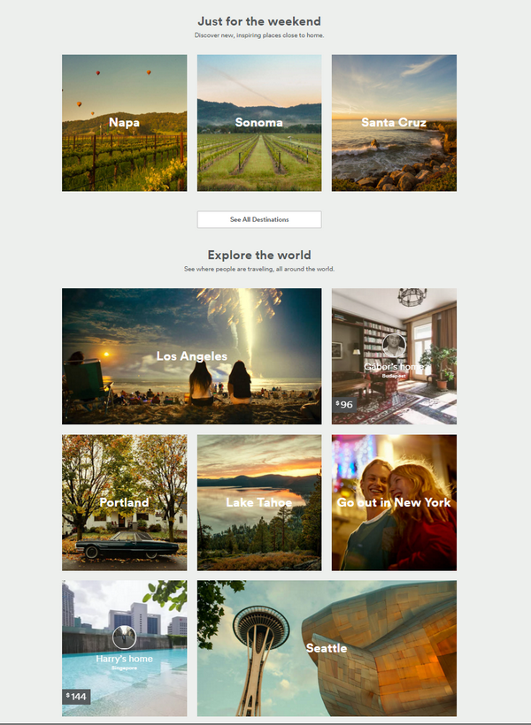

# AirBnB Recruiting Challenge (Kaggle Competition)

**Ruben Bloom**

- email: <rmb042@gmail.com>
- github: [darkruby501](https://github.com/darkruby501)

This repository contains my entry in the 2015/2016 AirBnB competition on Kaggle. This entry is also my captstone project for the [Springboard Data Science Intensive](https://www.springboard.com/workshops/data-science-intensive/).

**Can we predict where a new AirBnB user will make their first booking?**

> New users on Airbnb can book a place to stay in 34,000+ cities across 190+ countries. By accurately predicting where a new user will book their first travel experience, Airbnb can share more personalized content with their community, decrease the average time to first booking, and better forecast demand.
In this recruiting competition, Airbnb challenges you to predict in which country a new user will make his or her first booking. - [AirBnB Recruiting New User Bookings Challenge on Kaggle](https://www.kaggle.com/c/airbnb-recruiting-new-user-bookings)

### Reports and Slides
- [Slide Deck](https://docs.google.com/presentation/d/16UJ8_2Uu77xDzlTkADqexB1mcgOU_aUS0x8cB8VL07c/edit?usp=sharing): Overview of entry, results, and recommendations to AirBnB.
- [Detailed Technical Report](http://nbviewer.jupyter.org/github/darkruby501/AirBnBRecruitingComp/blob/master/Tech%20Report.ipynb): Explains data preparation and modelling in detail.

##### Example: personalized landing page based on predicted destination preference 

